# 🛡️ Retail Watchdog: AI Supply Chain Copilot


> **Purpose:** Internal operations tool  
> **Status:** Production MVP (Dockerized)

## 1. Problem

Retail support agents spend 15 minutes per ticket switching between:
* Inventory database (SQL)
* Policy documents (PDF)

Unsupervised AI refunds create financial risk from hallucinations.

## 2. Solution

AI agent that helps operations teams resolve tickets faster.

### What It Does:

1. **Database Integration:** Queries inventory and order status in real-time.
2. **Policy Search (RAG):** Retrieves relevant compensation rules from vector database.
3. **Safety Lock:** Requires explicit human approval before executing refunds (`human_confirmed=True`).
4. **Audit Logging:** Records all decisions to SQL table for compliance tracking.

**Result:** Average Handle Time reduced from 15 min to <10 seconds.

---

## 3. Architecture

```mermaid
graph TD
    User[👤 Operations Analyst] -->|Confirm/Action| UI[💻 Chainlit UI]
    UI -->|Thread_ID| Orchestrator[🧠 LangGraph Stateful Engine]
    
    subgraph "Azure AI Foundry"
        Orchestrator <-->|Reasoning| GPT[🤖 GPT-4o]
        RAGTool <-->|Embeddings| Emb[🔤 text-embedding-3]
    end
    
    subgraph "Safety Logic (Tools)"
        Orchestrator --> Router{Decision}
        Router -->|Read| SQLTool[📊 Inventory SQL]
        Router -->|Verify| RAGTool[📜 Policy RAG]
        Router -->|Write| RefundTool[🛡️ Safety Lock Refund]
    end
    
    subgraph "Audit & Persistence"
        RefundTool -->|Log| Audit[(📝 Audit Trail)]
        SQLTool <--> DB[(🗄️ SQLite / Azure SQL)]
        RAGTool <--> Vector[(📚 ChromaDB)]
    end
```



### Implementation Details:

* **Session Management:** Uses LangGraph's `MemorySaver` with `thread_id` for conversation context. Reduces token costs by avoiding history re-sending.
* **Safety Check:** `process_refund()` function blocks execution when `human_confirmed=False`.
* **Decoupled Design:** Agent logic (StateGraph) runs independently from UI (Chainlit). Can integrate with other interfaces.
* **Audit Trail:** SQL table logs every transaction with timestamp and approval status.

---

## 4. How to Run

Containerized for consistent deployment across environments.

### Prerequisites

* Docker Desktop
* Azure OpenAI (GPT-4o + text-embedding-3-small)

### 1. Build the Image

```bash
docker build -t retail-watchdog:gold .
```

### 2. Run the Container

Inject credentials securely using local `.env` file:

```bash
docker run -p 8000:8000 --env-file .env retail-watchdog:gold
```

---

## 5. Validation

Verify the system writes to the database:

```bash
# Get container ID
ID=$(docker ps -q -f ancestor=retail-watchdog:gold)

# Check audit log
docker exec -it $ID sqlite3 data/inventory.db "SELECT * FROM refunds_log;"
```

Output shows `order_id`, refund reason, and human confirmation flag (`1`).

---

## 6. Future Improvements

Current MVP uses local resources. Enterprise deployment would require:

| Component | Current | Production Target |
|-----------|---------|------------------|
| **Database** | SQLite (file) | Azure SQL Database |
| **Secrets** | .env file | Azure Key Vault |
| **Search** | ChromaDB (local) | Azure AI Search |
| **Logging** | Console | Application Insights |
| **Scale** | Single container | Container Apps |
