# 🛒 Retail Watchdog: AI Supply Chain Optimizer


> **Status:** MVP / Proof of Concept (Ready for Container Apps)

## 1. The Business Challenge (El Desafío)

In modern Retail, the disconnection between **Inventory Systems** (SQL) and **Corporate Policies** (Unstructured PDFs) creates friction in customer support.

* **The Problem:** Support agents take an average of **15 minutes** to cross-reference stock data with refund policies to make a decision.
* **The Impact:** High operational costs and low NPS (Net Promoter Score) due to delays.

## 2. The Solution (La Solución)

**Retail Watchdog** is an Autonomous AI Agent (Agentic Workflow) that orchestrates complex decision-making without human intervention.

It is not a chatbot; it is a **reasoning engine** that:

1. **Verifies** real-time stock status via SQL connections.
2. **Retrieves** the specific applicable return policy via Vector Search (RAG).
3. **Executes** the compliant business decision (Refund vs. Coupon).

**Result:** Resolution time reduced from 15 min to **<10 seconds**.

---

## 3. Technical Architecture (High Level)

This solution implements the **ReAct Pattern** (Reason + Act) on Azure.

```mermaid
graph TD
    User[👤 Business User] -->|Chat Interface| UI[💻 Chainlit UI]
    UI -->|Stream| Orchestrator[🧠 LangGraph Orchestrator]
    
    subgraph "Azure AI Foundry"
        Orchestrator <-->|Reasoning| GPT[🤖 GPT-4o]
        RAGTool <-->|Embeddings| Emb[🔤 text-embedding-3]
    end
    
    subgraph "Agent Logic (Nodes)"
        Orchestrator -->|Decide| Router{Decision}
        Router -->|Need Data?| SQLTool[🛠️ SQL Inventory Tool]
        Router -->|Need Rules?| RAGTool[🛠️ Policy RAG Tool]
    end
    
    subgraph "Data Persistence"
        SQLTool <-->|Query| DB[(🗄️ SQLite / Azure SQL)]
        RAGTool <-->|Search| Vector[(📚 ChromaDB / AI Search)]
    end
```



### The Stack

* **Brain:** Azure OpenAI (gpt-4o) for complex reasoning.
* **Orchestration:** LangGraph (Stateful Graph, preventing infinite loops).
* **Data Layer:** Hybrid approach using SQL (Transactional) + Vector Store (Knowledge).
* **Deployment:** Dockerized Microservice (Debian-slim based).

## 4. How to Run (Docker)

This project is containerized for immediate deployment.

### Prerequisites

* Docker Desktop installed.
* Azure OpenAI Endpoint & API Key.

### 1. Build the Image

```bash
docker build -t retail-watchdog:v1 .
```

### 2. Run the Container

Inject your Azure credentials at runtime (replace with your values):

```bash
docker run -p 8000:8000 \
  -e AZURE_OPENAI_API_KEY="your_key_here" \
  -e AZURE_OPENAI_ENDPOINT="https://your-resource.openai.azure.com/" \
  -e AZURE_OPENAI_DEPLOYMENT_NAME="gpt-4o" \
  -e AZURE_OPENAI_API_VERSION="2024-05-01-preview" \
  -e AZURE_OPENAI_EMBEDDING_DEPLOYMENT="text-embedding-3-small" \
  retail-watchdog:v1
```

### 3. Access

Open your browser at http://localhost:8000.

## 5. Demo Scenarios

| Scenario | Input Prompt | Expected Agent Behavior |
|----------|-------------|------------------------|
| Happy Path | "Status of order ORD-1001" | Checks SQL → Confirms Delivery. |
| Complex Logic | "Problem with order ORD-9902" | Checks SQL (Stock 0) → Checks Policy (RAG) → Offers Refund. |
| Policy Query | "Return policy for laptops?" | Skips SQL → Checks Policy (RAG) → Explains rules. |
